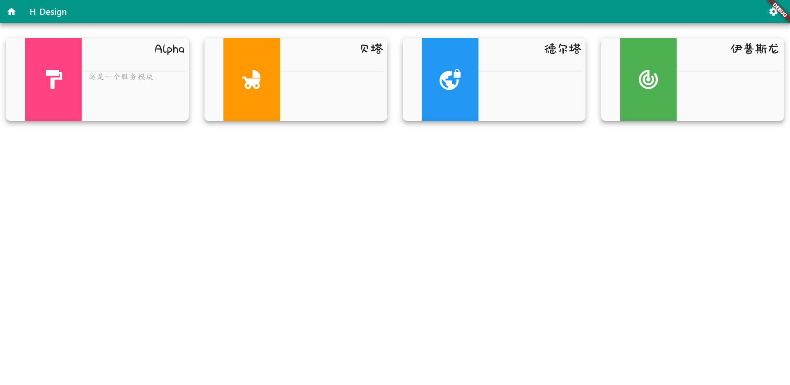
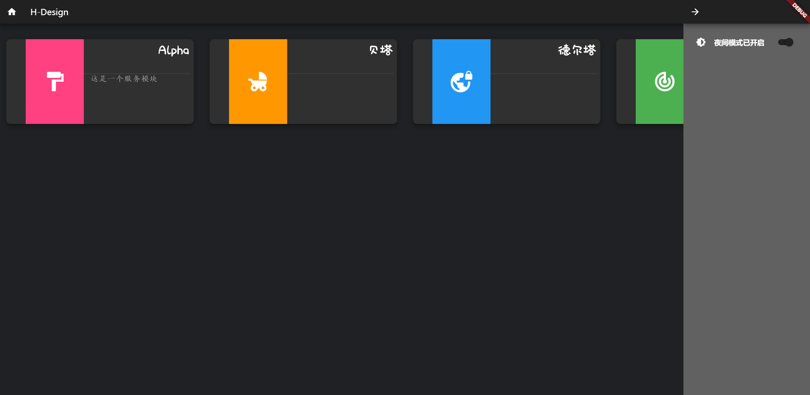
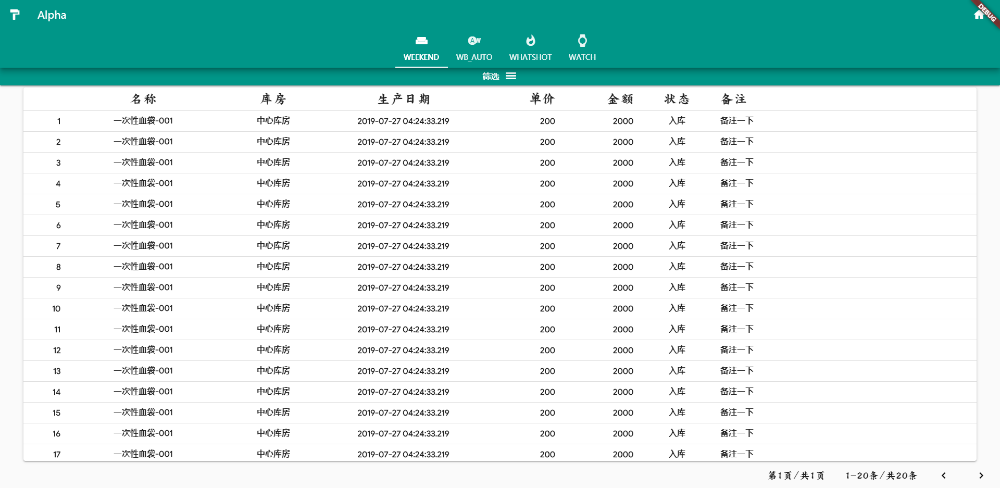
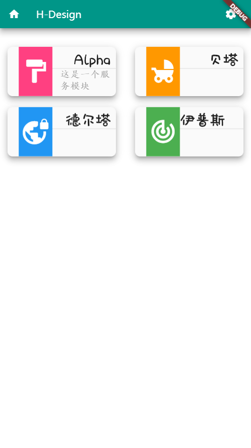
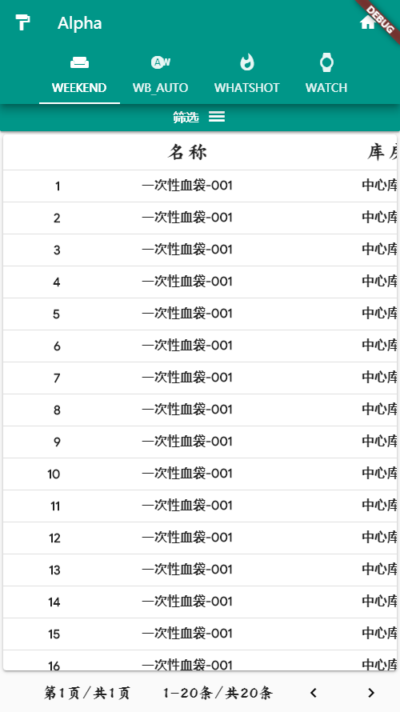

# H-DESIGN

#### Install the flutter_web build tools
```cmd
flutter pub global activate webdev
```

#### Load H-Design repository
```cmd
git clone git@github.com:HunterVillage/h-design.git
```

#### Update packages
```cmd
flutter pub upgrade
```

#### Start Up
```cmd
webdev serve --auto restart
```

#### build static file
```cmd
webdev build
```

#### View




